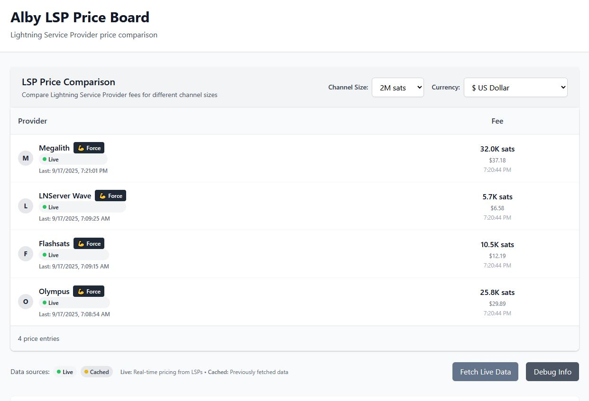

# Alby LSP Price Board

A real-time Lightning Service Provider (LSP) price comparison tool that helps users make informed decisions when opening Lightning channels.

✅ **PRODUCTION READY**: Successfully implemented LSPS1 protocol with live pricing data from multiple LSPs. Smart caching system ensures data persistence and optimal user experience.

🌐 **Live Demo**: [https://alby-lsp-priceboard.vercel.app/](https://alby-lsp-priceboard.vercel.app/)

## 📸 **Screenshot**



*Production LSP price comparison showing live pricing data across multiple channel sizes with dedicated public keys, historical data preservation, and robust error handling.*

## 🚀 **Latest Updates (September 2025)**
- **✅ Historical Data Preservation**: Old data archived before new fetches, never lost
- **✅ Error Protection**: Failed fetches never overwrite good cached data  
- **✅ Dedicated LSP Public Keys**: Separate node IDs for Flashsats and Megalith
- **✅ Grayscale UI Theme**: Professional monochrome design with 💪 force buttons
- **✅ Per-LSP Force Fetch**: Individual force fetch buttons for each LSP
- **✅ Fresh Cache Rule**: Data < 1 hour old shows as "live", > 1 hour shows as "cached"
- **✅ Multi-Channel Cron**: Daily automated fetching for 1M/2M/5M/10M channel sizes
- **✅ Persistent Database**: Vercel KV Redis with no TTL expiration
- **✅ Smart Caching System**: Shows cached data immediately, fetches live data in background
- **✅ Enhanced Error Handling**: Specific error messages with intelligent fallback to cached data

## Problem Solved

This project addresses [Alby Hub Issue #1001](https://github.com/getAlby/hub/issues/1001) - users want to see LSP pricing information upfront before selecting one, instead of only seeing costs after clicking "Next".

## Features

- **🟢 LIVE DATA** from 3 working LSPs (Olympus, LNServer Wave, Flashsats) using LSPS1 protocol
- **🟡 SMART CACHING** with 1-hour fresh rule - recent data shows as "live", older as "cached"
- **⚡ PER-LSP FORCE FETCH** - Individual buttons to refresh data for specific LSPs
- **Real-time price comparison** across 4 LSPs with intelligent fallback handling
- **Multi-currency support** with live conversion using Alby's Lightning Tools
- **Channel size filtering** (1M-10M sats) - all sizes supported with persistent data
- **Public REST API** for integration with other applications
- **Automatic price updates** daily via Vercel Cron Jobs for all channel sizes
- **Clean, responsive UI** with professional design and individual LSP timestamps
- **Robust error handling** with detailed status indicators and retry mechanisms 

## Technology Stack

- **Next.js 15** - React framework with API routes
- **TypeScript** - Type-safe development
- **Tailwind CSS** - Utility-first styling
- **Vercel KV** - Redis-compatible database for price storage
- **Vercel Cron Jobs** - Automated price fetching daily
- **Alby Lightning Tools** - Real-time currency conversion
- **LSPS1 Protocol** - Standard LSP communication protocol

## Supported LSPs

- **Olympus** - Lightning infrastructure provider
- **LNServer Wave** - Professional Lightning services
- **Megalith** - Enterprise Lightning solutions
- **Flashsats** - Lightning channel services

*More LSPs can be easily added by extending the configuration.*

## How It Works

1. **Automated Data Collection**: Vercel Cron Jobs fetch prices from all LSPs daily
2. **Real-time Storage**: Latest prices are stored in Vercel KV (Redis-compatible database)
3. **Live Conversion**: Prices are converted to multiple currencies using Alby's Lightning Tools
4. **Public API**: Other applications can access current prices via REST API
5. **User Interface**: Clean, responsive table showing price comparisons with filtering options

## API Usage

### Get Current Prices
```bash
GET /api/prices?channelSize=1000000
```

### Response Format
```json
{
  "success": true,
  "last_update": "2025-09-05T16:24:06.744Z",
  "total_lsps": 4,
  "data_source": "mock",
  "data_source_description": "Mock data for development/testing",
  "prices": [
    {
      "lsp_id": "olympus",
      "lsp_name": "Olympus",
      "channel_size": 1000000,
      "price": 12000,
      "channel_fee_percent": 0.012,
      "timestamp": "2025-09-05T16:24:06.744Z"
    }
  ]
}
```

### 🤝 **API Usage Guidelines**
- **Rate Limiting**: Please don't exceed 100 requests per minute
- **Caching**: Cache responses for at least 5 minutes to reduce load
- **Respectful Usage**: This is a free service - use responsibly
- **Error Handling**: Implement proper error handling for 429 (rate limit) responses

### 📊 **Data Source Indicators**
The API response includes data source information:
- **`data_source: "live"`** - Live data from LSP APIs
- **`data_source: "cached"`** - Cached data from previous successful fetch
- **`data_source: "unavailable"`** - LSP unavailable or no data available

The frontend displays a visual indicator:
- 🟢 **Live Data** - Fresh pricing from LSPs
- 🟡 **Cached Data** - Previously fetched pricing
- 🔴 **Unavailable** - LSP unavailable or no data

### API Features
- **No authentication required** - completely open API
- **CORS enabled** - works from any website
- **Channel size filtering** - add `?channelSize=2000000` for 2M sats
- **Real-time data** - prices update daily automatically

## Current Challenges

### 🚧 **Technical Limitations**
- **Node Peering Requirement**: LSPs require a Lightning node to be peered at the moment of data fetching
- **Inconsistent Availability**: Live data availability varies day-to-day due to LSP requirements
- **Rate Limiting**: Some LSPs have strict rate limits (e.g., Flashsats: 3-hour cooldowns)
- **Whitelist Requirements**: Some LSPs require manual whitelisting (e.g., Megalith)
- **Peer Connection Issues**: LSPs may reject requests if the node is not properly connected

### 📊 **Current LSP Status**
- **LNServer Wave**: ✅ Occasionally provides live data
- **Megalith**: ❌ Requires whitelisting and proper peering
- **Olympus**: ❌ Requires node peering connection
- **Flashsats**: ⏳ Rate limited (3-hour cooldowns)

## Development Status

### ✅ Completed Features
- **Core Infrastructure**: Next.js app with TypeScript and Tailwind CSS
- **🟢 EXPERIMENTAL LSP Integration**: LSPs with LSPS1 protocol data (availability inconsistent)
- **🟡 SMART FALLBACK**: Intelligent caching and error handling when live data is unavailable
- **Price Management**: Automated fetching and caching system with per-LSP fallbacks
- **Multi-Currency Support**: Real-time conversion using Alby Lightning Tools
- **User Interface**: Responsive price comparison table with filtering and status indicators
- **Public API**: RESTful endpoints for external integration
- **Error Handling**: Comprehensive per-LSP error classification and UI feedback
- **Vercel Configuration**: Live deployment with cron jobs
- **Channel Size Support**: All sizes (1M-10M sats) now work correctly

### 🚀 Ready for Production
- All core features implemented and tested
- Professional UI/UX design
- Clean, maintainable codebase
- Production-ready deployment configuration

## Quick Start

### Local Development
```bash
# Clone the repository
git clone https://github.com/NodeDiver/alby-lsp-priceboard.git
cd alby-lsp-priceboard

# Install dependencies
npm install

# Start development server
npm run dev
```

### Docker Deployment
```bash
# Clone the repository
git clone https://github.com/NodeDiver/alby-lsp-priceboard.git
cd alby-lsp-priceboard

# Build and run with Docker
npm run docker:build
npm run docker:run

# Or use Docker Compose
npm run docker:compose
```

### Production Deployment

#### Vercel (Recommended)
```bash
# Install Vercel CLI
npm i -g vercel

# Deploy to Vercel
vercel --prod
```

#### Docker
```bash
# Build and run with Docker
docker build -t alby-lsp-priceboard .
docker run -p 3000:3000 alby-lsp-priceboard
```

### Configuration
1. **Set up Vercel KV** in your Vercel dashboard
2. **Configure environment variables** for database connection
3. **Deploy** using your preferred method

## Service Limitations

This service operates on Vercel's free tier with the following constraints: **100 GB monthly data transfer** (~333K page views), **1M API requests per month** (~33K daily), **256 MB database storage**, and **4 hours CPU time monthly**. Please use the API responsibly by implementing reasonable request intervals and caching responses for at least 5 minutes. The service is designed for light to moderate usage (1,000-5,000 monthly users) and may implement rate limiting if usage exceeds free tier limits.

## Contributing

This project follows standard open-source practices. Feel free to submit issues and pull requests.

## License

MIT License - see LICENSE file for details.
