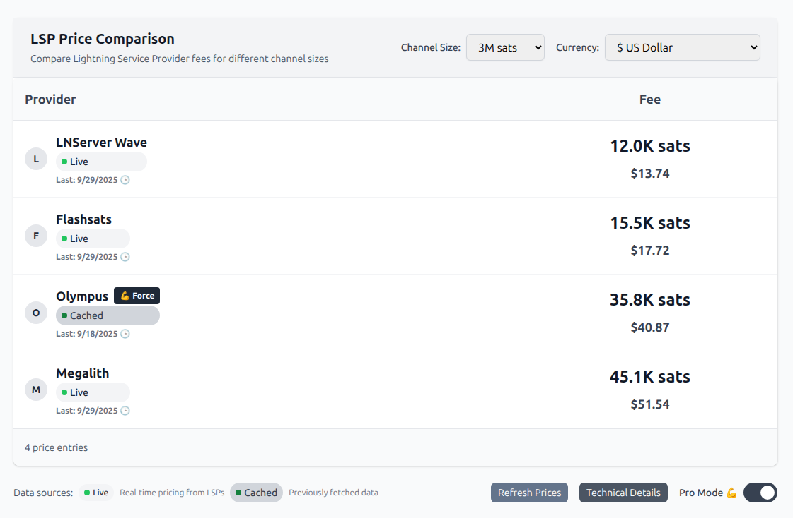
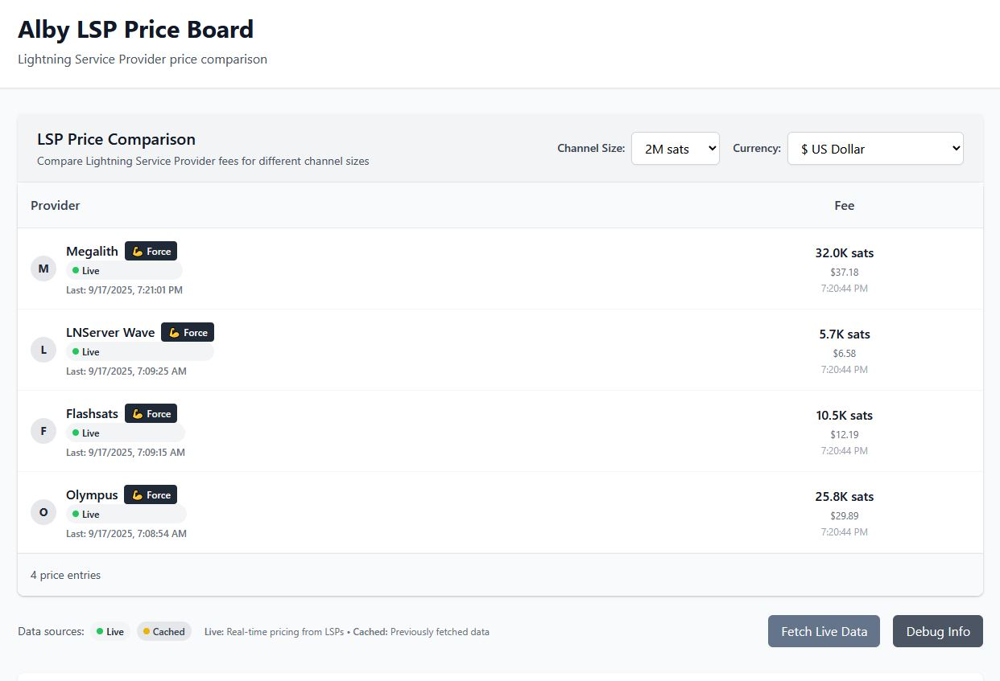
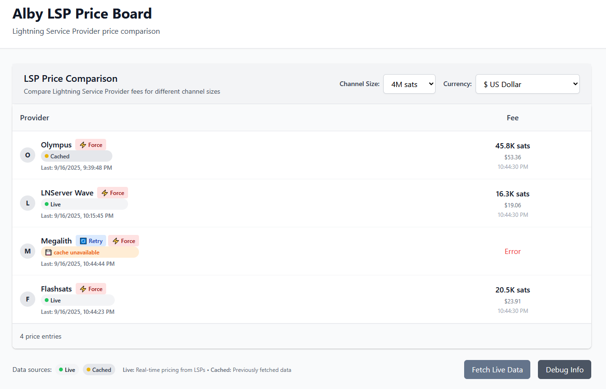

# Alby LSP Price Board v0.2.1

A real-time lightning Service Provider (LSP) price comparison tool that helps users make informed decisions when opening lightning channels.

✅ **PRODUCTION READY v0.2.1**: Successfully implemented LSPS1 protocol with live pricing data from multiple LSPs. Smart caching system ensures data persistence and optimal user experience with major UX and readability improvements.

🌐 **Live Demo**: [https://alby-lsp-priceboard.vercel.app/](https://alby-lsp-priceboard.vercel.app/)

## 📸 **Screenshots**

Menu: [v0.2](#v02) • [v0.1](#v01) • [v0.05](#v005)

<details open>
  <summary id="v02">v0.2</summary>

  

  *Latest version with Pro Mode toggle, enhanced typography, improved UX, fixed hydration errors, and stable table layout.*

</details>

<details>
  <summary id="v01">v0.1</summary>

  

  *Production LSP price comparison showing live pricing data across multiple channel sizes with dedicated public keys, historical data preservation, and robust error handling.*

</details>

<details>
  <summary id="v005">v0.05</summary>

  

  *Early development version showing the initial working prototype.*

</details>

## 🚀 **Previous Updates**

Menu: [v0.2.1](#v021) • [v0.2](#v02-updates) • [v0.1](#v01-updates)

<details open>
  <summary id="v021">v0.2.1 (September 2025)</summary>

  ### Bug Fixes & Stability Improvements
  - **✅ Fixed Hydration Error**: Resolved React hydration mismatch in Pro Mode toggle system
  - **✅ Fixed Column Layout**: Implemented fixed table layout to prevent Fee column position shifting
  - **✅ Improved State Management**: Added proper hydration handling for localStorage-dependent features
  - **✅ Fixed Loading Loop**: Resolved recurring "getting prices from providers..." loading state issue
  - **✅ Fixed WebLN Error Handling**: Enhanced support button error handling for user rejection scenarios
  - **✅ Fixed Button Visibility**: Corrected Pro Mode buttons showing during loading state
  - **✅ Code Refactoring**: Implemented 7/11 ChatGPT suggestions for improved code quality and performance

</details>

<details>
  <summary id="v02-updates">v0.2 (September 2025)</summary>

  ### Major UX & Readability Improvements
  - **✅ Pro Mode Toggle System**: Added Pro Mode 💪 toggle with conditional button visibility for advanced features
  - **✅ Comprehensive Typography Overhaul**: Upgraded all text sizes and hierarchy for better readability and professional appearance
  - **✅ Enhanced Price Display**: Made sats prices `text-2xl font-bold` and fiat prices `text-lg font-semibold` for better visual hierarchy
  - **✅ Timestamp Display Improvements**: Shows full date with hoverable clock tooltips for better time information
  - **✅ UI Polish & Consistency**: Fixed button sizing, improved legend styling, enhanced color consistency
  - **✅ Animation Enhancements**: Added professional fade-in animations for Pro Mode buttons
  - **✅ UI Component Cleanup**: Removed unwanted tooltips and hover effects

</details>

<details>
  <summary id="v01-updates">v0.1 (September 2025)</summary>

  - **✅ Historical Data Preservation**: Old data archived before new fetches, never lost
  - **✅ Error Protection**: Failed fetches never overwrite good cached data  
  - **✅ Dedicated LSP Public Keys**: Separate node IDs for Flashsats and Megalith
  - **✅ Grayscale UI Theme**: Professional monochrome design with 💪 force buttons
  - **✅ Per-LSP Force Fetch**: Individual force fetch buttons for each LSP
  - **✅ Fresh Cache Rule**: Data < 1 hour old shows as "live", > 1 hour shows as "cached"
  - **✅ Multi-Channel Cron**: Daily automated fetching for 1M/2M/5M/10M channel sizes
  - **✅ Persistent Database**: Vercel KV Redis with no TTL expiration
  - **✅ Code Quality**: Unified architecture, LSPS1 compliance, consistent error handling
  - **✅ Unit Tests**: Jest testing framework with LSPS1 error mapping and DB serialization tests
  - **✅ Health Monitoring**: `/api/health` endpoint for system status and uptime monitoring
  - **✅ UI Clarity v0.1**: Clear explanations, helpful tooltips, improved empty states, and user-friendly labels
  - **✅ Smart Caching System**: Shows cached data immediately, fetches live data in background
  - **✅ Enhanced Error Handling**: Specific error messages with intelligent fallback to cached data

</details>

## Problem Solved

This project addresses [Alby Hub Issue #1001](https://github.com/getAlby/hub/issues/1001) - users want to see LSP pricing information upfront before selecting one, instead of only seeing costs after clicking "Next".

## Features

- **🟢 Live Data**: Real-time pricing from 3 LSPs using LSPS1 protocol
- **🟡 Smart Caching**: 1-hour fresh rule with intelligent fallback to cached data
- **⚡ Force Fetch**: Individual refresh buttons for each LSP
- **💰 Multi-Currency**: Live conversion with 20+ supported currencies
- **📊 Channel Sizes**: Support for 1M-10M sat channels with persistent storage
- **🔌 Public API**: REST endpoints for external integrations
- **⏰ Auto-Updates**: Daily cron jobs for all channel sizes
- **🎨 Pro Mode**: Advanced features toggle with conditional UI
- **🛡️ Error Handling**: Robust fallback with detailed status indicators 

## Technology Stack

- **Next.js 15** - React framework with API routes
- **TypeScript** - Type-safe development
- **Tailwind CSS** - Utility-first styling
- **Vercel KV** - Redis-compatible database for price storage
- **Vercel Cron Jobs** - Automated price fetching daily
- **Alby lightning Tools** - Real-time currency conversion
- **LSPS1 Protocol** - Standard LSP communication protocol

## Supported LSPs

- **Olympus** - lightning infrastructure provider
- **LNServer Wave** - Professional lightning services
- **Megalith** - Enterprise lightning solutions
- **Flashsats** - lightning channel services

*More LSPs can be easily added by extending the configuration.*

## How It Works

1. **Automated Data Collection**: Vercel Cron Jobs fetch prices from all LSPs daily
2. **Real-time Storage**: Latest prices are stored in Vercel KV (Redis-compatible database)
3. **Live Conversion**: Prices are converted to multiple currencies using Alby's lightning Tools
4. **Public API**: Other applications can access current prices via REST API
5. **User Interface**: Clean, responsive table showing price comparisons with filtering options

## API Usage

### Get Current Prices
```bash
GET /api/prices?channelSize=1000000
```

### Health Check
```bash
GET /api/health
```

### Response Format
```json
{
  "success": true,
  "data_source": "live",
  "total_lsps": 4,
  "prices": [
    {
      "lsp_id": "olympus",
      "lsp_name": "Olympus",
      "channel_size": 1000000,
      "price": 15750000,
      "source": "live",
      "timestamp": "2025-09-17T12:38:44.799Z"
    }
  ]
}
```

### API Features
- **No authentication** - completely open
- **CORS enabled** - works from any website  
- **Channel filtering** - `?channelSize=2000000` for 2M sats
- **Live/cached data** - automatic fallback system
- **Rate limit**: ~100 requests/minute

## LSP Status

- **🟢 Olympus**: Live data with LSPS1 protocol
- **🟢 LNServer Wave**: Live data with autodiscovery  
- **🟢 Megalith**: Live data with dedicated public key
- **🟢 Flashsats**: Live data with dedicated public key
- **🟡 Smart fallback**: Cached data when live fetches fail

## Quick Start

### Local Development
```bash
# Clone the repository
git clone https://github.com/NodeDiver/alby-lsp-priceboard.git
cd alby-lsp-priceboard

# Install dependencies
npm install

# Start development server
npm run dev

# Run tests
npm test
```

### Docker Deployment
```bash
# Clone the repository
git clone https://github.com/NodeDiver/alby-lsp-priceboard.git
cd alby-lsp-priceboard

# Build and run with Docker
npm run docker:build
npm run docker:run

# Or use Docker Compose
npm run docker:compose
```

### Production Deployment

#### Vercel (Recommended)
```bash
# Install Vercel CLI
npm i -g vercel

# Deploy to Vercel
vercel --prod
```

#### Docker
```bash
# Build and run with Docker
docker build -t alby-lsp-priceboard .
docker run -p 3000:3000 alby-lsp-priceboard
```

### Configuration
Set up Vercel KV and configure environment variables for database connection.

## 🎯 **Architecture & Data Sources**

### Dual-Source Data Fetching
Our LSP price board now uses a **dual-source architecture** that solves the LSP blocking problem:

1. **Primary Source: Alby API** - Fetches live pricing data from Alby's established LSP relationships
2. **Fallback Source: LSPS1 Protocol** - Direct LSPS1 protocol calls for comprehensive coverage

This approach eliminates Node ID and IP blocking issues while maintaining full data coverage and reliability.

### Data Sources by Channel Size
- **1M, 2M, 3M channels**: Primarily from Alby API with LSPS1 fallback
- **4M-10M channels**: Alby API first (when available), then LSPS1 protocol
- **All data**: Stored identically in historical database regardless of source

## 🚀 **Future Improvements**
- **Enhanced Analytics**: Extended historical data visualization and trend analysis
- **Premium Features**: Advanced filtering and export capabilities
- **Performance Optimization**: Further caching improvements and response time optimization

## Contributing

Submit issues and pull requests on [GitHub](https://github.com/NodeDiver/alby-lsp-priceboard).

## License

MIT License - see LICENSE file.
